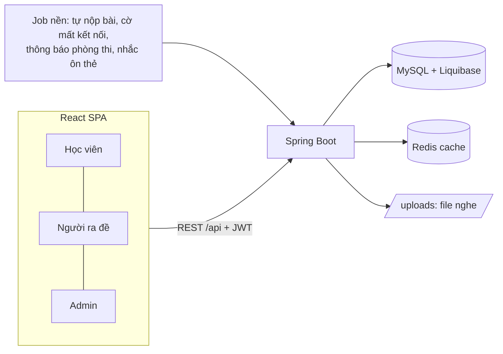

# Tàng Thư Các — Nền tảng ôn luyện & thi thử JLPT

Tài liệu trình bày với người hướng dẫn · 14/09/2026 · nhánh `feature/rooms-and-course`

---

## 1. Dự án là gì

Nền tảng web giúp người Việt **ôn luyện và thi thử tiếng Nhật theo chuẩn JLPT (N5 → N1)**. Có ba vai trò:

| Vai trò | Làm được gì |
|---|---|
| **Học viên** | Luyện đề tự do, vào phòng thi thử, đi lộ trình ôn tập, học thẻ ghi nhớ (từ vựng, chữ Hán, thẻ tự soạn), sổ tay câu sai, đánh dấu câu kèm ghi chú, xem điểm JLPT và bảng xếp hạng |
| **Người ra đề** | Ngân hàng câu hỏi (kèm bài đọc, file nghe), soạn đề chia phần theo JLPT, mở phòng thi và theo dõi trực tiếp, xem bài làm và thống kê theo câu / kỹ năng, soạn lộ trình |
| **Admin** | Tổng quan ôn luyện, quản lý tài khoản (khoá, nâng quyền), duyệt lộ trình |

---

## 2. Công nghệ & kiến trúc

| Tầng | Công nghệ |
|---|---|
| Backend | Java 21, Spring Boot 3.2.5 (Web, Data JPA, Security, OAuth2 Client, Validation), JWT, springdoc OpenAPI |
| Dữ liệu | MySQL 8, **Liquibase** (toàn bộ schema và dữ liệu đi qua migration), Redis (cache phiên thi; không bắt buộc) |
| Frontend | React 19, Vite 8, React Router 7, Axios |
| Đăng nhập | Email / mật khẩu và Google SSO; access token ngắn hạn, refresh token trong cookie HttpOnly |

**Quy mô hiện tại:**
- Backend: 19 controller, 118 endpoint, 31 entity, ~18.500 dòng Java.
- Frontend: 26 trang, 17 component, ~13.400 dòng.
- Migration Liquibase từ v1.0.0 tới v2.2.0.

---

## 3. Phản hồi của người hướng dẫn → đã xử lý thế nào

### Đợt phản hồi 1

| Phản hồi | Đã làm |
|---|---|
| "Tạo kì thi mới" sai tên use case | Chốt bảng thuật ngữ: **đề thi · phòng thi · lượt làm bài · học viên / thí sinh · người ra đề**; áp dụng trên toàn bộ giao diện |
| Bỏ lớp → nhóm người dùng có giới hạn, **ai nhanh thì vào** | Bỏ hẳn Lớp học. **Phòng thi** có sức chứa; cấp ghế bằng khoá dòng (`SELECT … FOR UPDATE`) nên hai người vào cùng lúc không bị trùng ghế |
| Chưa có học ôn theo lộ trình | **Lộ trình ôn tập**: chặng mở tuần tự, chặng có bài kiểm tra phải đạt ngưỡng mới qua; **gợi ý ôn theo điểm yếu** và **bài xếp trình độ** đầu vào |
| Trọng tâm tiếng Nhật, cần xử lý riêng | Xem mục 4 |
| Thí sinh tự do: tìm kiếm / bookmark / ghi chú | Ô tìm kiếm (đề công khai và lộ trình); đánh dấu câu kèm ghi chú |
| Nhấn là lưu đáp án — chưa tính tới scale | Nháp lưu `localStorage`, gửi server theo lô, có giới hạn tần suất; server là nguồn sự thật |
| sessionStorage hay localStorage | Chọn `localStorage`: vẫn còn nháp sau khi trình duyệt bị đóng hoặc crash |
| Thoát trình duyệt giữa lúc thi | Gửi nốt nháp bằng `fetch keepalive`, khôi phục nháp khi mở lại; **giờ thi tính theo server** nên thoát ra không được cộng thêm giờ |
| Chuyển tab → trình duyệt tiết kiệm tài nguyên | Gửi ngay khi tab bị ẩn, hỏi lại server khi tab hiện lại, xử lý trường hợp tab bị trình duyệt gỡ khỏi bộ nhớ |
| Chưa bàn kỹ security / concurrency | Xem mục 5 |
| Luyện thi / thi thử / chấm tự luận | Đã chốt: **câu tự luận không đưa vào đề thi** (JLPT không có), chỉ giữ ở phần luyện tập |

### Đợt phản hồi 2

| Phản hồi | Đã làm |
|---|---|
| Khoá học nên là **lộ trình ôn tập** | Đổi luật đi (tuần tự, ngưỡng đạt), đổi toàn bộ chữ trên giao diện |
| Tạo bài thi cần **bộ lọc** câu hỏi | Lọc theo trình độ → bộ câu hỏi → mức độ → dạng câu → nội dung; hiện cơ cấu đề đang soạn |
| Chỉ làm bài khi **bấm bắt đầu** hoặc **tới giờ hẹn** | Phòng thi có các pha Nháp → Sảnh chờ → Đang thi → Kết thúc |
| Hết giờ hiện **bảng xếp hạng** | Có ở cả phòng thi và đề tự do; bằng điểm thì ai làm nhanh hơn đứng trên |
| Dùng thuật ngữ ôn luyện thi | Bỏ các khối "Thao tác nhanh / Cần xử lý" |

### Tự rà soát lại sau hai đợt

Tự đứng ở vai người dùng rà lại toàn dự án (`audit_2026-09.md`), rồi làm 4 đợt sửa. Riêng hai chức năng quan trọng được làm lại từ góc nhìn người dùng:
- **Phòng thi** (`room_review_2026-09.md`): 21 bất cập được sửa, gồm cho vào muộn, theo dõi trực tiếp, link mời, nhân bản buổi thi, thu bài khi mời ra giữa giờ.
- **Thẻ ghi nhớ** (`flashcard_review_2026-09.md`): học viên tạo được bộ thẻ riêng, mỗi ngày chỉ mở một số thẻ mới, nút đánh giá hiện trước khoảng cách gặp lại.

---

## 4. Chuyên biệt hoá JLPT

- **Đề chia phần như kỳ thi thật**: 文字・語彙 / 文法・読解 / 聴解, mỗi phần có đồng hồ riêng; hết giờ phần nào thì server khoá phần đó. Có nút áp cấu trúc chuẩn theo từng cấp.
- **Điểm quy đổi 0–180** theo nhóm điểm của từng cấp, có **điểm liệt từng phần**, kết luận **Đỗ / Trượt** kèm lý do. Ghi rõ đây là ước lượng tuyến tính, không phải IRT.
- **Bài đọc hiểu**: một đoạn văn dùng cho nhiều câu, và đoạn văn được lưu kèm theo đề.
- **Nghe (聴解)**: tải file audio lên. Phòng thi phát không cho tua, **server đếm lượt nghe** (mặc định 1 lần như JLPT) nên F5 không nghe thêm được.
- **Dạng câu 並べ替え** (sắp xếp câu); mỗi câu hỏi gắn kỹ năng để thống kê.
- **Học tập**: thẻ ghi nhớ từ vựng / chữ Hán theo thuật toán lặp lại ngắt quãng SM-2, sổ tay câu sai, lộ trình theo cấp.

---

## 5. Điểm kỹ thuật đáng chú ý

| Vấn đề | Cách giải |
|---|---|
| Gian lận thời gian | Server là nguồn thời gian duy nhất (`ExpiresAt`); job nền tự nộp bài quá giờ |
| Mất kết nối | Heartbeat → cờ `AtRisk`; người ra đề thấy ngay trên màn theo dõi phòng |
| Sửa ngân hàng câu hỏi làm hỏng bài đã thi | Mỗi đề lưu **bản sao (snapshot)** câu hỏi và đáp án; không trả `isCorrect` ra client |
| Vào thi trùng phiên (double-click, hai tab) | Khoá duy nhất `(ExamID, StudentID, AttemptNumber)` kết hợp khoá dòng khi tạo phiên |
| Tranh ghế phòng thi | `SELECT … FOR UPDATE` trên phòng và ghế lớn nhất |
| Nhiều máy chủ cùng chạy job | Bảng `SchedulerLocks`: mỗi lượt job chỉ một máy chạy |
| Chép bài giữa các thí sinh | Xáo câu và đáp án theo từng lượt; hạt giống là `submissionId` nên F5 vẫn giữ nguyên thứ tự |
| Dò mật khẩu, spam API | Giới hạn tần suất: đăng nhập 10 lần/phút theo IP, lưu đáp án 120 lần/phút; vượt ngưỡng trả 429 |
| Lộ token | Refresh token nằm trong cookie HttpOnly; đăng ký không tự chọn được vai trò (lỗ tự cấp quyền Admin đã được bịt) |
| Dữ liệu demo lẫn với migration | Bộ dữ liệu thật đi qua Liquibase **context** `realdata`, có precondition nên không bao giờ nạp trùng, có script gỡ sạch |
| Học dồn thẻ | Mỗi ngày mở tối đa 20 thẻ mới; thẻ cần ôn luôn xếp trước thẻ mới |

---

## 6. Kịch bản demo (~15 phút)

Chuẩn bị:
- Chạy backend với `LIQUIBASE_CONTEXTS=demo,realdata` (DB `mockpj` đã có sẵn dữ liệu), rồi chạy frontend bằng `npm run dev`.
- Mật khẩu chung cho mọi tài khoản dưới đây: `OnThi@2026`.

| # | Tài khoản | Thao tác | Điểm nhấn |
|---|---|---|---|
| 1 | `anh.tran@tangthucac.test` (người ra đề) | **Phòng thi → Tạo buổi thi**: chọn đề, cho vào muộn 15 phút, ghi lời dặn, mở sảnh chờ → chép **link mời** | Một form duy nhất; mỗi phòng là một buổi thi cho một đề |
| 2 | `khang.do@tangthucac.test` (học viên, cửa sổ ẩn danh) | Mở link mời → đăng nhập → vào thẳng sảnh chờ có **đồng hồ đếm ngược** | Link mời vẫn giữ mã phòng sau khi đăng nhập |
| 3 | Người ra đề | Bấm **Bắt đầu làm bài** → tab **Theo dõi**: ai đang làm, đã làm tới câu mấy | Theo dõi trực tiếp |
| 4 | Học viên | Làm vài câu, tắt tab, mở lại → nháp vẫn còn; nộp bài | Autosave, giờ thi tính theo server |
| 5 | Người ra đề | **Kết thúc sớm** → tab **Kết quả**: bảng xếp hạng, mở bài làm, xuất CSV | Thu bài cả phòng ngay khi kết thúc |
| 6 | `long.nguyen@tangthucac.test` (học viên N3) | **Lịch sử điểm** → bài thi thử chia phần | Điểm quy đổi JLPT, Đỗ/Trượt, điểm liệt |
| 7 | Học viên | **Thẻ ghi nhớ → Tạo bộ thẻ** → soạn 2 thẻ, tìm và thêm 今日 → **Học bộ này** | Thẻ tự soạn; nút đánh giá hiện "1 ngày / 4 ngày" |
| 8 | Học viên | **Lộ trình ôn tập** → chặng khoá / chặng có bài kiểm tra | Luật đi tuần tự |
| 9 | `quan.pham@tangthucac.test` (admin) | Tổng quan ôn luyện, duyệt lộ trình, khoá tài khoản | Vai trò quản trị |

Tài khoản đặc biệt nếu cần minh hoạ thêm:
- `minh.ton@tangthucac.test`: đã bị khoá.
- `linh.phan@tangthucac.test`: vừa đăng ký, chưa có dữ liệu.

Danh sách đầy đủ nằm trong `tools/seed/README.md`.

---

## 7. Kiểm thử

- **Kiểm thử đầu-cuối gọi API thật trên MySQL** (không mock), chạy trên bản sao DB để không làm bẩn dữ liệu:

  | Phạm vi | Số kiểm tra đạt |
  |---|---|
  | Đợt 1 | 20/20 |
  | Đợt 2 | 36/36 |
  | Đợt 3 | 46/46 |
  | Đợt 4 | 44/44 |
  | Phòng thi (bản làm lại) | 39/39 |
  | Thẻ ghi nhớ (bản làm lại) | 40/40 |
  | Bộ dữ liệu thật | 37/37 |

- **Test đơn vị**: chấm điểm JLPT, lịch phần thi, xáo đề, giới hạn tần suất, thuật toán SM-2.
- **Kiểm tra giao diện**: chụp màn hình tự động bằng trình duyệt headless cho từng luồng chính.

---

## 8. Giới hạn hiện tại & hướng tiếp

| Chưa làm / còn giới hạn | Hướng xử lý |
|---|---|
| Mở tab thứ hai thì tab cũ chưa bị "đóng băng" (cơ chế lease) | Lease theo phiên thi, lưu trong Redis |
| Autosave tầng 3 (Redis write-behind) và đo tải | Gom ghi theo lô, đo bằng k6 hoặc JMeter |
| Điểm JLPT quy đổi tuyến tính, không phải IRT | Cần dữ liệu thật đủ lớn mới hiệu chỉnh được |
| File nghe và giới hạn tần suất chỉ nằm trên một máy chủ | Chuyển file sang kho đối tượng (S3), bộ đếm sang Redis |
| AI sinh câu hỏi, đề thích ứng (adaptive) còn là khung | Ngoài phạm vi 4 đợt đã duyệt |
| Đề **công khai** gắn vào phòng thi vẫn luyện được ngoài giờ phòng | Nên dùng đề riêng tư cho phòng thi, hoặc chặn ngay khi gắn đề |
| Chưa có dữ liệu N1 | Bổ sung nội dung |

---

## 9. Câu hỏi có thể được hỏi

- **Vì sao không đổi tên bảng `Exam`, `Courses` cho khớp thuật ngữ mới?**
  Đổi tên bảng là một đợt chuyển dữ liệu nhưng người dùng không được lợi gì. Chữ trên giao diện và trong tài liệu đã đổi hết.
- **Hai người cùng bấm vào phòng còn đúng một ghế?**
  Khoá dòng phòng rồi mới đọc số ghế lớn nhất: người vào sau thấy phòng đã đủ và nhận lỗi 409.
- **Thí sinh sửa giờ máy tính thì sao?**
  Client chỉ hiển thị đồng hồ. Hạn nộp nằm ở server, quá hạn thì job nền tự nộp bài.
- **Vì sao chọn localStorage?**
  sessionStorage mất khi trình duyệt bị đóng hoặc crash, đúng lúc cần khôi phục nháp nhất. Nháp chỉ là bản tạm; server vẫn là nguồn sự thật.
- **Liquibase với dữ liệu mẫu có đụng nhau không?**
  Dữ liệu tách theo context (`demo`, `realdata`) và có precondition. Nguyên tắc: changeset đã chạy thì không sửa, muốn đổi thì thêm changeset mới.

---

## Tài liệu kèm theo (cùng thư mục `docs/`)

| File | Nội dung |
|---|---|
| `revision_plan.md` | Kế hoạch sửa theo từng mục phản hồi, và các bẫy đã gặp |
| `audit_2026-09.md` | Tự rà soát toàn dự án và kết quả 4 đợt sửa |
| `room_review_2026-09.md` | Rà soát và làm lại phòng thi |
| `flashcard_review_2026-09.md` | Rà soát và làm lại thẻ ghi nhớ |
